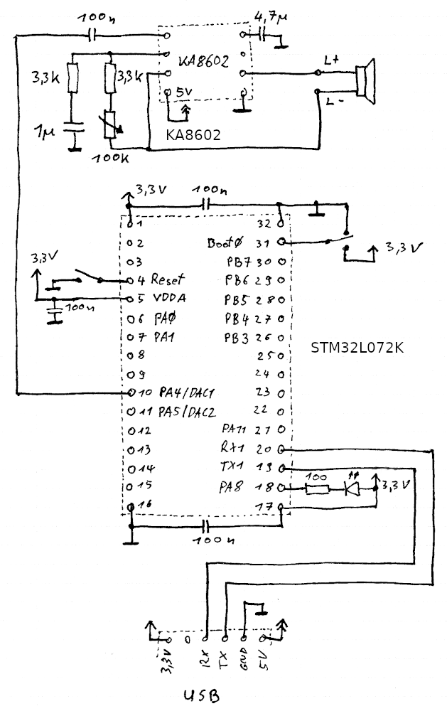
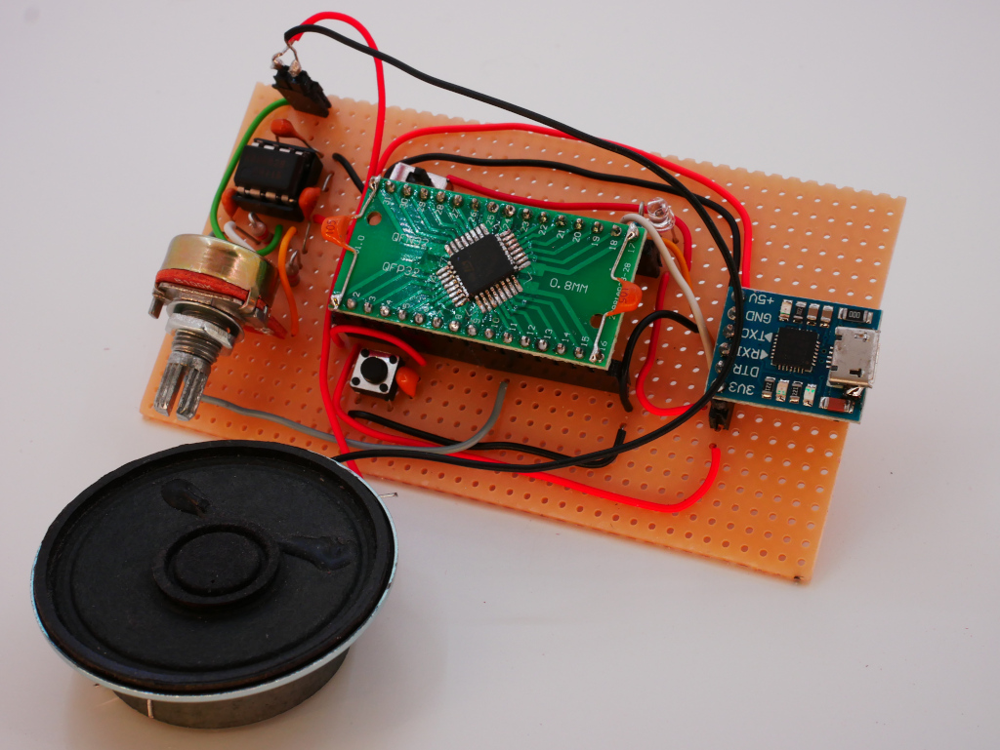

# Simple Blink Example for the STM32L072Kx

 * USB UART Converter is connected to pins 19 and 20 of the STM32L072
 * A switch at pin 31 (BOOT0) selects between in-system programming and user code mode
 * A button at pin 4 (RESET) will reset the STM32L072 and either start the ISP bootloader or the user code (depending on the state of BOOT0 pin 31)
 * This example will use the LED at pin 18 (PA8)
 * Use a USB to 3.3V TTL UART converter (e.g. with CP2102) for programming with the STM32FLASH tool

